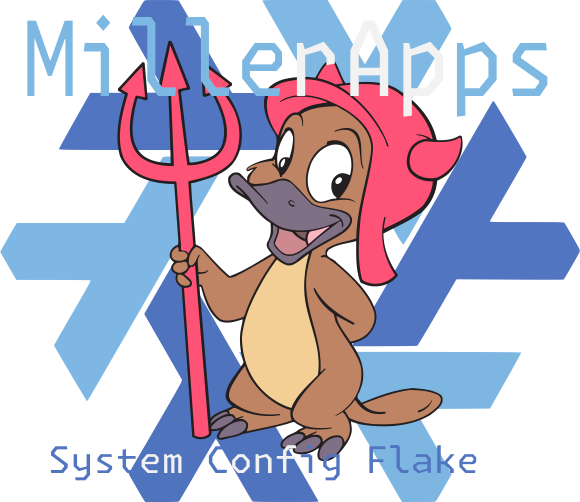

# Nix-Darwin, Nix-Home-Manager, & Homebrew

This repository serves as a guide for setting up and managing my macOS system using Nix-Darwin, Nix Home Manager, and Homebrew. 
It is designed for personal reference but can also be useful to others interested in a similar setup.

How it works:
- The Nix package manager is used as the primary way to handle needed clitools, lanaues, and apps.
- Nix-Darwin sets up the system based on the flake.nix and the correlating files in the nix-darwin directory.
- Nix-Home-Manager hooks into Nix-Darwin to handle the .config files and othr .files in the home directory.
- Homebrew is used to install macOS apps and fonts. This is handled by Nix-Darwin's homebrew module. Homebrew is also installed via [Nix-Homebrew](https://github.com/zhaofengli/nix-homebrew).

> [!NOTE]
> This is a first round at intergrating nix-darwin, nix-home-manager, and homebrew. This is a work in progress and will be updated as I learn more.
> If you have any tips or know of a better way to do something, please let me know.

## Table of Contents
- [Introduction](#nix-darwin-nix-home-manager--homebrew)
- [Nix Language Overview](#nix-language-overview)
- [Install Guide for Nix-Darwin](#install-guide-for-nix-darwin)
  - [Install Nix Package Manager](#install-nix-package-manager)
  - [Clone Repository](#clone-repository)
  - [Install Nix-Darwin](#install-nix-darwin)
  - [Apply Configuration](#apply-configuration)
- [Nix-Darwin Directory Structure](#nix-darwin-directory-structure)
  - [Explanation of the Structure](#explanation-of-the-structure)
	- [How It Works](#how-it-works)

## Nix Language Overview

The Nix language is a domain-specific, declarative, and functional language designed for defining derivations—precise descriptions of how existing files or inputs are used to generate new ones.

> [!Tip]
> For a beginner-friendly introduction, visit the [Introduction to Nix Language](https://nix.dev/tutorials/nix-language).

Language Features realvent to this setup:

> [!Note]
> Will be upadated as I learn more. Possiblely some examples.

| Example | Description |
|---------|-------------|
| `"hello world"` | A basic string |
| `# Comment` | Simple comment |
| `true`, `false` | Boolean values |
| `[ 1 2 3 ]` | A list |
| `{ x = 1; y = 2; }` | An attribute set |
| `"${pkgs.vim}/bin/vim"` | String interpolation |
| `{ inherit pkgs; }` | Inherit keyword |
| `import ./file.nix` | Import a Nix file |
| `{ ... }` | Ellipsis (ignored arguments) |
| `~/.config` | Home directory path |
| `./relative/path` | Relative path |
| `{ config, pkgs, ... }: { }` | Basic configuration |

## Install Guide for Nix-Darwin

> [!IMPORTANT]
> The Nix package manager is required to install nix-darwin. If you have not installed Nix, please follow the instructions below.

1. Install [Nix package manager](https://nixos.org/download/#nix-install-macos) using the following command:
```sh
sh <(curl -L https://nixos.org/nix/install)
```
2. Clone the repo to your home directory:
```sh
nix run nixpkgs#git -- clone https://github.com/MillerApps/dotfiles.git ~/dotfiles
```
> [!NOTE]
> This will:
> •	Temporarily use Git
> •	Clone your repository
> •	Create a dotfiles directory in your home folder
> •	Place all repository contents in ~/dotfiles

3. Install [nix-darwin](https://github.com/LnL7/nix-darwin) for full detatils see, the installation instructions at the link. Use the flake section.
    
> [!NOTE]
> This installs nix-darwin using the flake feature of nix. This is the recommended way to install nix-darwin.
> This also assumes you cloned the repo to `~/dotfiles`
    
```sh
nix run nix-darwin --extra-experimental-features "nix-command flakes" -- switch --flake ~/dotfiles/nix-darwin#macbook
```
4. Apply the configuration:
```sh
darwin-rebuild switch --flake ~/dotfiles/nix-darwin#macbook
```
## Nix-Darwin directory structure

The nix-darwin directory is structured as follows:


📁 nix-darwin
├── 🔒 flake.lock
├── ⚙️ flake.nix
├── ⚙️ home.nix
└── 📁 modules
    ├── ⚙️ default.nix
    ├── ⚙️ homebrew.nix
    ├── ⚙️ macos.nix
    └── ⚙️ zsh.nix


> [!IMPORTANT]
> The modules directory splits the config into modular files, which form the overall Nix-Darwin configuration.
> `default.nix` is the contianer for all modules. This is automatically sourced by nix-darwin when importing `./modules` in `flake.nix`.

### Explanation of the Structure

1. flake.nix

The primary configuration file for Nix Flakes. It defines inputs (dependencies like Nixpkgs, Home Manager, and Darwin modules) and outputs (system-wide and user-specific configurations). It serves as the entry point for building and managing the Nix-Darwin setup.

2. flake.lock

A lock file that ensures the setup is reproducible by fixing dependencies to specific versions. This file is automatically generated and ensures consistent behavior across systems.

3. home.nix

This file contains user-specific configurations, managed by Home Manager. It handles settings like shell preferences, environment variables, and dotfiles (my main use case).

4. modules Directory

A collection of modular files that define specific aspects of the system or user configuration. Each file in this directory is dedicated to a particular functionality or component, such as managing macOS preferences, Homebrew packages, or shell settings.

- `default.nix`: The “container” for all modules, listing all the files to be included. This file is automatically sourced when the modules directory is imported in `flake.nix`.
- Other files (e.g., `homebrew.nix`, `macos.nix`, `zsh.nix`) split the configuration into smaller, reusable pieces for better organization.

### How It Works

- `flake.nix` references `./modules` and other configuration files to build the overall system and user setup.
- The `modules/default.nix` file ensures that all relevant modules in the modules directory are included automatically.
- This structure allows for a clear separation of concerns, making configurations easier to manage and extend.
